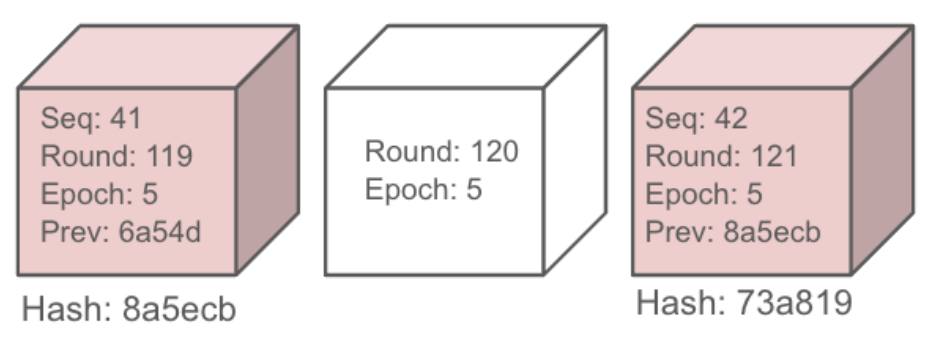

# Simplex consensus for Avalanche

## Introduction

### Why Simplex?

The scientific literature is full of different consensus protocols,
and each has its own strengths and weaknesses.

Picking Simplex [1] as a consensus protocol of choice for Subnet only Validators has the following benefits:

- There is no view change sub-protocol, making it simple to implement.
- It has been peer-reviewed by the academic community (TCC 2023).
- Its censorship-resistance relies on leader rotation, unlike timeouts which may suffer from false positives.


The main counter-argument against choosing Simplex is that a single block proposer (leader) consensus protocol
has limited throughput compared to a protocol that shards the transactions space
across different nodes and proposes batches in parallel.

While the argument is correct, a fast consensus protocol isn't enough to guarantee a high end to end throughput for a blockchain.
To fully utilize parallel block proposers, the VM should also support distributed transaction processing.

The HyperSDK, Avalanche's "high throughput" VM of choice, 
[plans to employ](https://hackmd.io/@patrickogrady/rys8mdl5p#Integrating-Vryx-with-the-HyperSDK-High-Level-Sketch) 
techniques that totally order certificates of transaction chunk availability, which are of small size.

Since the design of the HyperSDK does not require a high throughput consensus protocol,
there is no need to invest development time in a parallel block proposer consensus protocol.


### Node membership: PoS vs PoA setting

Simplex is suitable for both the Proof of Stake and the Proof of Authority settings.
For the sake of succinctness and simplicity, this document uses Proof of Authority (PoA) terminology.

A PoA setting can be thought of a PoS setting where all nodes have precisely the same stake,
making each node have a "single vote". Similarly, a PoS setting can be thought of a PoA setting
where the `N` nodes with the highest stake get to vote, and each node has a number of votes that is 
proportional to the stake of the node with the lowest stake among the `N` nodes.


## Protocol high-level description as per the Simplex paper

### Node membership:

The protocol assumes a static set of `n` nodes, out of which up to and not including a third, are faulty.

A quorum of nodes is defined as the smallest set such that two such sets of nodes intersect in at least one correct node. 
If `n=3f+1` where `f` is the upper bound on faulty nodes, then a quorum is any set of nodes of size `2f+1`.
Each node has a private key used for signing.
The corresponding public key used for verifying signatures is known to all other nodes.

### Rounds and roles:

A node progresses in monotonically increasing and successive rounds.
Each round has a (different) leader node designated to propose blocks and disseminate them to the rest of the nodes.
Nodes only respond to the first block they see from the leader of that round.
Once a leader node proposes a block, it participates in the remaining steps of the round as if it was a non-leader node.
Except from the step in which the leader broadcasts a block, every other step involves a node broadcasting a signed message. 
All nodes can verify whether a node indeed signed the message or not.

There exists a time period `T` that is a system-wide parameter and is used by the protocol.

For an  arbitrary length string `x`, we denote `H(x)` to be the hash of `x`,
where `H` is a collision resistant hash function with an output size of at least 32 bytes.

The flow of the protocol is as follows:

1. At round `i`, a leader node builds a block `b` and sends it to the rest of the nodes.
2. Each node broadcasts a vote `<vote, i, H(b)>` in favor of the block.
3. For each node, one of the two mutually exclusive events happen:
   1. If the node collects within time `T` a quorum of votes on `b` of the form `<vote, i, H(b)>` or for a quorum of votes on an empty block of the form `<vote, i, ⊥>`, the node then moves to participate in the next round `i+1`.
   2. Else, the node does not collect a quorum of votes within time `T`, and it then broadcasts a vote for an empty block `<vote, i, ⊥>` and waits to either collect a quorum of votes of the form `<vote, i, ⊥>` or `<vote, i, H(b)>` after which it moves to the next round `i+1`.
4. Upon collecting a notarization or an empty notarization on `b` which consists of a quorum of votes of the form `<vote, i, ⊥>` or `<vote, i, H(b)>` respectively, the node broadcasts the notarization (or the empty notarization) before moving to round `i+1`.
5. Starting from round `i+1`, each node that did not vote for `<vote, i, ⊥>` (due to a timeout) or collect a quorum of votes on `<vote, i, ⊥>` broadcasts a finalization message `<finalize, i, H(b)>`.
6. Each node that collects a quorum of finalization messages considers the block `b` as finalized, and can deliver it to the application.


### Avoiding excessive block production

In official Simplex protocol, a leader node must propose a block within a timely manner:

> if, during some iteration, a process detects no progress (i.e. due to a faulty leader or network), it will timeout and vote for the dummy block.

While this fits a setting where there is constant user activity, it can be quite wasteful.

For example, in a network where most users are in the same country or continent, there are at least 6 hours in each 24 hours when very little activity is expected to take place.

Rotating a leader every few seconds carries a network bandwidth, disk I/O and CPU overhead that should be avoided if possible.

To that end, in our adaptation of Simplex, the application can hint to the consensus layer whether it expects a block to be proposed.
Nodes of our adaptation of Simplex will only vote on the empty block if the application hints that a block should be proposed by the leader.

It is up to the application to ensure that transactions arrive to the leader and to a quorum of correct nodes.

## Reconfiguring Simplex

The Simplex paper assumes a static set of nodes. 
However, validator nodes of a blockchain network may be added or removed while the protocol totally orders transactions. 
The act of adding or removing a validator node from the members of a consensus protocol is called reconfiguration.

When Simplex finalizes a block that causes the node membership to change, we say that block contains a reconfiguration event.

A reconfiguration event can be either a transaction that changes the node membership in the chain governed by the chain itself, 
or it can even be a proof originating from a chain not governed by the bespoken chain, which simply attests the new 
set of nodes running the Simplex consensus protocol. 

The only requirements for Simplex are:

1. All nodes participating in consensus must apply the reconfiguration event for the same round.
2. The change must be atomic and not depend on anything but the blockchain (no reliance on external API calls).

Reconfiguring a Simplex protocol while it totally orders transactions poses several challenges:

1. In Simplex, node `p` may collect a quorum of finalization messages at a different round than node `q` 
(for example, block `b` was notarized by a quorum of nodes at round `i` but only node `p` 
collected a quorum of finalization votes in round `i+1`, and the rest voted for the empty block in round `i+1`
and then collected the finalization votes in round `i+2`). 
It is therefore not safe to apply the new node membership whenever a node collects a quorum of finalization votes, 
as nodes at the same round may end up having different opinions of which nodes are eligible to be part of a quorum.
2. In Simplex, blocks are proposed by alternating nodes.
It may be the case that node `p` proposes a block in round `i` which contains a transaction which removes node `q`
from the membership set, and the next node to propose a block is node `q`, in round `i+1`.
If `q` proposes a block in round `i+1`, and it is notarized before the block in round `i` is finalized, 
what is to become of the block proposed by `q` and other blocks built and notarized on top of it? 
Block `q` should not have been notarized because it was proposed by a node that was removed in round `i`,
and therefore conceptually, all transactions in successive blocks need to be returned into the mem-pool.

In order to be able to dynamically reconfigure the membership set of the Simplex protocol, two techniques will be employed:


* `Epochs`: Each round will be associated with an epoch. An epoch starts either at genesis or in the round successive to a round containing a reconfiguration event. An epoch ends when a block containing a reconfiguration event is finalized.

  The epoch number is always the sequence number of the block that caused the epoch to end. Meaning, if a block with a sequence of `i` in epoch `e` contained a reconfiguration event, the next epoch would be epoch number `i` regardless of `e`.

* `Parallel instances`: Once a node finalizes a block which contains a reconfiguration event, it starts a fresh new instance of Simplex for the new epoch, but still retains for a while the previous instance of the previous epoch, to respond to messages of straggler nodes in the previous epoch that haven’t finalized the last block of that epoch.

Given an old block `b` in epoch `e` and observing a block `b’` created in epoch `e+k` along with a set of finalization messages, it seems impossible to determine if `b’` is authentic or not, as there were reconfiguration events since the block `b` in epoch `e` was finalized. Therefore, the set of finalization messages on `b'` cannot be authenticated, as it’s not even clear how many nodes are there in epoch `e+k` in the first place.

Fortunately, there is a way to check whether block `b’` is authentic or not: Let `{e, e+i, …, e+j, e+k}` be the series of epochs from block `b` to block `b’`, and let {`b, d, …, d’, b’`} be blocks where the sequence number of `d` and `d’` are `e+i` and `e+j` respectively. To be convinced of the authenticity of block `b’` one can just fetch the series of blocks {`b, d, …, d’, b’`} and validate them one by one. Since each block encodes its epoch number, and epoch numbers are block sequences that contain reconfiguration events, 
then after validating the aforementioned series of blocks we are guaranteed whether `b’` is authentic or not.
Hereafter we call the series of blocks  {`b, d, …, d’, b’`}  an *Epoch Change Series* (ECS).

In practice, reconfiguration would work as follows:

1. For a block `b` containing a reconfiguration event, in round `i` at epoch `e`, any descendant block of `b` in epoch `e` are treated as regular blocks, but they must only contain the metadata and no block data. 
Any descendant blocks that contain transactions are invalid.
2. Since it is impossible to hand over these blocks and their corresponding finalizations to the application, the finalizations are written to the Write-Ahead-Log (WAL) along with the metadata
   to ensure proper restoration of the protocol state in case of a crash.
3. Once a node finalizes and commits block `b`, it terminates its previous Simplex instance for epoch `e` and instantiates a new Simplex instance for the new epoch.
Any message regarding epoch `e` sent by a remote node is then responded by the finalization certificate for block `b`, which notifies the remote node about the existence of block `b`,
assisting it to transition into the new epoch.


### Structuring the blockchain:

Unlike the official Simplex paper [1] where empty blocks end up as part of the blockchain, In our adaptation of it, the blockchain consists only of finalized blocks, and blocks are numbered consecutively but the round numbers in which these blocks were proposed, are not consecutive. Each block contains the corresponding protocol metadata for the round in which it was proposed.




As depicted above, in case of an empty block (in white) the protocol metadata for the round is the round and epoch numbers. For regular blocks, the block sequence and the previous block hash are also part of the protocol metadata.
By looking at the sequence numbers and the round numbers of the two data blocks, it can be deduced that round 120 corresponds to an empty block.

### Storage of blocks and protocol state

Simplex will assume an abstract and pluggable block storage with two basic operations of retrieval of a block by its sequence, and indexing a block by its sequence.

```go
type Storage interface {
   // Height returns how many blocks have been accepted so far.
   Height() uint64
   
   // Retrieve retrieves the block and corresponding finalization
   // certificate from the storage, and returns false if it fails to do so.
   Retrieve(seq uint64) (Block, FinalizationCertificate, bool, error) 
   
   // Index persists the given block to stable storage and associates it with the given sequence.
   Index(seq uint64, block Block, certificate FinalizationCertificate)   
}
```

The `FinalizationCertificate` message is defined later on, and `Block` is defined as follows:

```go
type Block interface {
    // Metadata is the consensus specific metadata for the block
    Metadata() Metadata
	
    // Bytes returns a byte encoding of the block
    Bytes() []byte
	
	// EndsEpoch returns whether the block causes an epoch change
	EndsEpoch() bool
}
```

Where `Metadata` is defined as a digest and the `ProtocolMetadata`:

```go
type Metadata struct {
    // ProtocolMetadata is the state of the protocol after
    // committing a corresponding block.
    ProtocolMetadata ProtocolMetadata

    // Digest returns a collision resistant short representation of the block's bytes
    Digest []byte
}
```

The `ProtocolMetadata` is defined below and is computed by the block proposer before the block is proposed.
The `Digest` of the block is then computed over the entire block's byte representation which
should also include the `ProtocolMetadata`. The Metadata plays a vital part of the protocol's runtime,
as its `Digest` plays the role of a short binding commitment to the block built by the leader and disseminated to all nodes, and the `ProtocolMetadata`
is essentially a configuration of Simplex in a given round.

```go
// ProtocolMetadata is the state of the protocol after
// committing a block that corresponds to this metadata.
type ProtocolMetadata struct {
   // Version defines the version of the protocol this block was created with.
   Version uint8
   // Epoch returns the epoch in which the block was proposed
   Epoch uint64
   // Round returns the round number in which the block was proposed. 
   // Can also be an empty block.
   Round uint64
   // Seq is the order of the block among all blocks in the blockchain.
   // Cannot correspond to an empty block.
   Seq uint64
   // Prev returns the digest of the previous block
   Prev []byte
}

```

### Persisting protocol state to disk

Besides long term persistent storage, Simplex will also utilize a Write-Ahead-Log (WAL). 

A WAL is used to write intermediate steps in the consensus protocol’s operation. It’s needed for preserving consistency in the presence of crashes. 
Essentially, each node uses the WAL to save its current step in the protocol execution before it moves to the next step. If the node crashes, it uses the WAL to find at which step in the protocol it crashed and knows how to resume its operation from that step.  
The WAL will be implemented as an append-only file which will be pruned only upon a finalization of a data block. The WAL interface will be as follows:

```go
type WriteAheadLog interface {
   // Append appends the given record to the WAL,
   // and if prune is true, then the content of the WAL
   // may contain only the given record afterward.
   Append(record Record, prune bool)  
   // ReadAll() returns all records in the WAL
   ReadAll() []Record  
}
```

The `prune` parameter indicates to the WAL that it is safe to prune the content of the WAL.
In practice, whether the WAL prunes the entire data is up to implementation. 
Some implementations may only prune the WAL once it grows beyond a certain size,
for efficiency reasons.
It is important for the append operation to be atomic with high probability.
Therefore, a checksum mechanism is employed to detect if Simplex crashed mid-write.


A Record written by a WAL is defined as:

```protobuf
Record {  
   version uint8
   size uint32  
   type uint32  
   payload bytes  
   checksum bytes   
}
```


The type corresponds to which message is recorded in the record, and each type corresponds to a serialization of one of the following messages:

- The `Proposal` message is written to the WAL once a node receives a proposal from the leader. It contains the block in its raw form.
It also contains the protocol metadata associated to that block.
- Once a node collects a quorum of vote messages from distinct signers, it persists a `Notarization` message to the WAL.
- Of course, it might be that it’s not possible to collect a quorum of Vote messages, and in that case the node times out until it collects a quorum of `EmptyVote` messages and persists an `EmptyNotarization` message to the WAL.
- Finally, a node eventually collects a quorum of `Finalization` messages for a block. If all prior blocks have been indexed in the `Storage`,
a `FinalizationCertificate` is passed to the application along with the corresponding `Block`. Otherwise, the `FinalizationCertificate` is written to the WAL to prevent it being lost.

The messages saved in the WAL and the messages they transitively contain are as follows:

- [Proposal](#proposal): A proposal is a block received by a leader of some round. It is written to the WAL
so that if the node crashes and recovers, it will never vote to a different block for that round. 
- [Notarization](#notarization): When a node collects a quorum of [SignedVote](#signedvote) messages on the same
  [Vote](#vote) message, it persists a notarization message to the WAL, so that when it recovers from a crash
it will not vote for the empty block for that round.
- [EmptyNotarization](#emptyNotarization): Similarly to the notarization, a node also persists an empty notarization
once it collects a quorum of [SignedEmptyVote](#signedEmptyVote) messages on the same [EmptyVote](#emptyVote) message.
- [FinalizationCertificate](#finalizationCertificate): Once a node collects a quorum of [SignedFinalization](#signedFinalization) messages
on the same [Finalization](#finalization), it persists a finalization certificate to the WAL,
in case the corresponding block cannot be written yet to the storage. 

In case the signature algorithm allows aggregation of signatures, we define the aggregated messages below:

- [AggregatedSignedVote](#aggregatedSignedVote)
- [AggregatedSignedEmptyVote](#aggregatedSignedEmptyVote)
- [AggregatedSignedFinalization](#aggregatedSignedFinalization)

These messages then become part of the [Notarization](#notarization), [EmptyNotarization](#emptyNotarization), and [FinalizationCertificate](#finalizationCertificate)
respectively.


#### Finalization certificates and epoch changes

A finalization certificate message of epoch `e` for sequence `i` is not written to the WAL if it corresponds to a block that is an ancestor of a block with sequence `f` that changes the current epoch,
unless sequences previous to `i` have not been committed.
If all sequences prior to `i` have been committed, and sequences `e, ..., i` are all not epoch change blocks, the finalization certificate for sequence `i` is written to the  storage atomically with the block.

A finalization certificate message of any other block for that epoch, is written to the WAL.
In other words, we persist to the WAL all finalizations of epoch `e` starting from the block that ends the epoch `e`.
The reason is that we may not be able to obtain a finalization for the block with sequence `f` until we finalize some descendant blocks
in epoch `e`, but as per our configuration protocol, these blocks contain no transactions, so they cannot be made part of the blockchain.
Therefore, in order to retain crash fault tolerance, we persist these finalizations to the WAL.


Two useful facts can be deduced from the structure of the messages written to the WAL:

1. The WAL of a node is not unique to that node, and two nodes in the same round may have the same WAL content.
2. Nodes can verify each other's WAL content. 

Combining the two above facts leads to a conclusion: Nodes can safely replicate the WAL from each other.

### Simplex and synchronization of disconnected nodes

In a real internet wide deployment, nodes may experience message loss due to plenty of reasons.  A consensus protocol that relies on messages being broadcast once, needs to be able to withstand sudden and unexpected message loss or know how to recover when they occur.  Otherwise, a node that missed a message or two, may find itself stuck in a round as the rest of the nodes advance to higher rounds. While consistency is not impacted, degradation of liveness of a consensus protocol can be severely detrimental to end user experience.

A node that has been disconnected or just missed messages can synchronize with other nodes.  
The synchronization mechanism is divided into two independent aspects:

1. Detection of the straggler node that it needs to synchronize
2. The straggler node synchronizing

In order to detect that a node is straggling behind, nodes send each other a message containing the current epoch and round number when they establish communication.

A node considers itself behind if another node can convince it that a higher round or epoch number exists.
When a node connects to another node who is straggling behind, it sends it a finalization or a notarization which proves that a quorum of nodes progressed further.

If a node discovers it is behind, there are two mutually exclusive scenarios:

1. The node is behind in the round number, but not in the epoch number.
2. The node is behind also in the epoch number.

If the node is behind just in the round number, it reaches to the nodes it knows and fetches missing blocks (with finalizations) as well as notarizations and empty notarizations.

However, if the node is behind also in the epoch number, it first reaches the nodes it knows in order to fetch an ECS, in order to discover the latest set of members.   
Once it has established the latest membership of nodes it needs to interact with, it proceeds with synchronizing the blocks, notarizations and empty notarizations.

The blocks and (empty) notarizations are replicated subject to the following rules:

1. A notarization in round `i` isn’t fetched if there exists a block and a corresponding finalization certificate for round `j > i` that were replicated (replicating nodes prefer to replicate blocks over notarizations).
2. Blocks (along with the corresponding finalizations) are fetched and written to the storage in-order.
3. If the last message in the WAL is about round `i` and a block of round `j > i` is fetched along with its finalization certificate, the message of round `i` is pruned from the WAL.
4. If a notarization of a regular block is fetched from a remote node, then the block corresponding to the notarization must be fetched as well.
5. If an empty notarization is fetched from a remote node, then the block for that round needs not to be fetched.
6. A node that replicated a notarization, writes it to the WAL in the same manner it would have written it during its normal operation.
7. A notarization for a block in round `i` is regarded as a notarization on a parent block in round `i-1` if the previous hash of the notarization
of round `i` corresponds to the hash of the block of round `i-1`. This rule can be recursively applied to any block in round `j < i`.

In order for a node to synchronize the WAL, we define the following messages:

- [NotarizationRequest](#notarizationRequest): A request inquiring whether a given round has been notarized.
or notarized via empty votes.
- [NotarizationResponse](#notarizationResponse): A response that contains either a notarization or an empty notarization.
- [BlockRequest](#blockRequest): A request inquiring about a block for a given sequence.
- [BlockResponse](#blockResponse): A response containing the block of the bespoken sequence.


## Simplex API

In order for the consensus protocol to be part of an application, such as avalanchego, 
Simplex will both depend on APIs from the application, and also give APIs for the application to use it.

Examples of APIs that Simplex would expect from the application, 
are APIs for sending and signing messages, an API that would be triggerred once a block has been finalized,
and an API to build a block.

An example of an API that Simplex would expose to the application, as an API to receive messages from the network.

In order to make the API compact, an all-purpose `Message` struct would be defined:

```go
type Message struct {
	Type MsgType
	// One of:
	*V SignedVote
	*E SignedEmptyVote
	*F SignedFinalization
	*N NotarizationRequest
	*E EmptyNotarizationRequest
	*B BlockRequest
	*NR NotarizationResponse
	*ER EmptyNotarizationResponse
	*BR BlockResponse
}
```

It is the responsibility of the application to properly handle authentication, marshalling and wire protocol,
and to construct the `Message` properly.

Compared to the snowman consensus, the Simplex API would be at the engine level. 
The reason for that it would be possible to integrate Simplex into a toy application for early testing,
and also in order to be able to structure tests to run an entire network of nodes.

### The Simplex engine API to the application:

```go
type Consensus interface {
    // AdvanceTime hints the engine that the given amount of time has passed.
    AdvanceTime(time.Duration)
    
    // HandleMessage notifies the engine about a reception of a message.
    HandleMessage(msg Message, from NodeID)
	
    // Metadata returns the latest protocol metadata known to this instance.
    Metadata() ProtocolMetadata
}

```

### The application API to the Simplex engine consists of several objects:

The two most important APIs that an application exposes to Simplex, 
are an API to build blocks and as mentioned before, an API to store and retrieve them:


```go
type BlockBuilder interface {
    // BuildBlock blocks until some transactions are available to be batched into a block,
    // in which case a block and true are returned.
    // When the given context is cancelled by the caller, returns false.
    BuildBlock(ctx Context, metadata ProtocolMetadata) (Block, bool)
	
    // IncomingBlock returns when either the given context is cancelled,
    // or when the application signals that a block should be built.
    IncomingBlock(ctx Context)
}
```


```go
// BlockDeserializer deserializes blocks according to formatting
// enforced by the application.
type BlockDeserializer interface {
	// DeserializeBlock parses the given bytes and initializes a Block.
	// Returns an error upon failure.
	DeserializeBlock(bytes []byte) (Block, error)
}
```


Whenever a Simplex instance recognizes it is its turn to propose a block, it calls
into the application in order to build a block via the `BlockBuilder`. 
Similarly, when it has collected enough finalizations for a block,
it passes the block and the finalizations to the application layer, which in turn, is responsible
not only for indexing the block, but also removing the transactions of the block from the memory pool.

After receiving a block from the leader node, Simplex only votes on a succinct representation of the block's bytes.
Therefore, Simplex calls into the application to compute the digest on a block:

```go
type BlockDigester interface {
	Digest(block Block) []byte
}
```

In order for signatures on notarizations or finalizations to be verified, we define the following verification object:

```go
type Verifier interface {

    // VerifySignature verifies the signature of the given signer on the given digest.
    VerifySignature(signer bytes, digest bytes, signature bytes) error

    // SetEpochChange sets the epoch to correspond with the epoch
    // that is the result of committing this block.
    // If the block doesn't cause an epoch change, this is a no-op.
    SetEpochChange(Block) error
	
}
```
Blocks are verified using a `BlockVerifier`. It is the responsibility of the application that every block
is verified while taking into account ancestor blocks of the given block.

```go
type BlockVerifier interface {
	VerifyBlock(block Block) error
}
```

In order to detect whether a commit of a `Block` would cause the current epoch to end,
Simplex invokes its `EndsEpoch` method.


In order to send messages to the members of the network, a communication object
which also can be configured on an epoch basis, is defined:

```go
type Communication interface {
	
    // Nodes returns all nodes known to the application.
    Nodes() []NodeID
	
    // Send sends a message to the given destination node
    Send(msg Message, destination NodeID)
    
    // Broadcast broadcasts the given message to all nodes 
    Broadcast(msg Message)

    // SetEpochChange sets the epoch to correspond with the epoch
    // that is the result of committing this block.
    // If the block doesn't cause an epoch change, this is a no-op.
    SetEpochChange(Block) error
	
}
```

[1] https://eprint.iacr.org/2023/463


## Acknowledgements

Thanks to Stephen Buttolph for invaluable feedback on this specification.


# Appendix


## Messages persisted to the Write-Ahead-Log

<a name="proposal"></a>
```protobuf
Proposal {  
  block bytes  
}
```


<a name="vote"></a>

```protobuf
Vote {  
   version uint8  
   digest bytes  
   digest_algorithm uint32  
   seq uint64  
   round uint64  
   epoch uint64  
   prev_hash bytes
}
```

<a name="signedvote"></a>

```protobuf
SignedVote {
    vote Vote
    signature_algorithm uint32
    signer bytes
    signature bytes
} 
```

<a name="notarization"></a>

```protobuf
Notarization {
  vote Vote
  signature_algorithm uint32
  repeated signer bytes
  repeated signature bytes
}
```

<a name="emptyVote"></a>

```protobuf
EmptyVote {  
   version uint8  
   round uint64  
   epoch uint64
}
```

<a name="signedEmptyVote"></a>

```protobuf
SignedEmptyVote {  
   empty_vote EmptyVote  
   signature_algorithm uint16  
   signer bytes  
   signature bytes  
}
```


<a name="emptyNotarization"></a>

```protobuf
EmptyNotarization {
        empty_vote EmptyVote
        signature_algorithm uint32
        repeated signer bytes
        repeated signature bytes  
}
```

<a name="finalization"></a>

```protobuf
Finalization {  
   version uint8  
   digest bytes  
   digest_algorithm uint32  
   seq uint64  
   round uint64  
   epoch uint64  
   prev bytes  
}
```

<a name="signedFinalization"></a>

```protobuf
SignedFinalization {  
   finalization Finalization  
   signature_algorithm uint16  
   signer bytes  
   signature bytes  
}
```

<a name="finalizationCertificate"></a>

```go
type FinalizationCertificate struct {
        signature_algorithm uint32
	Finalization         Finalization
        repeated signer bytes
        repeated signature bytes
}
```


<a name="aggregatedSignedVote"></a>

```protobuf
AggregatedSignedVote {  
    vote Vote  
    signature_algorithm uint16  
    signers repeated bytes
    signature bytes  
}
```

<a name="aggregatedSignedEmptyVote"></a>

```protobuf
AggregatedSignedEmptyVote {  
    empty_vote EmptyVote  
    signature_algorithm uint32
    signers repeated bytes  
    signature bytes  
}
```

<a name="aggregatedSignedFinalization"></a>

```protobuf
AggregatedSignedFinalization {  
    finalization Finalization  
    signature_algorithm uint16  
    signers repeated bytes  
    signature bytes  
}
```

## Messages intended for peer-to-peer replication


<a name="notarizationRequest"></a>

```protobuf
NotarizationRequest {
  round uint64
}
```

<a name="notarizationResponse"></a>

```protobuf
NotarizationResponse {
  oneof {
      notarization Notarization
      empty_notarization EmptyNotarization
    }
}
```

<a name="blockRequest"></a>

```protobuf
BlockRequest {
  seq uint64
}
```

<a name="blockResponse"></a>

```protobuf
BlockResponse {
  block Block
}
```
