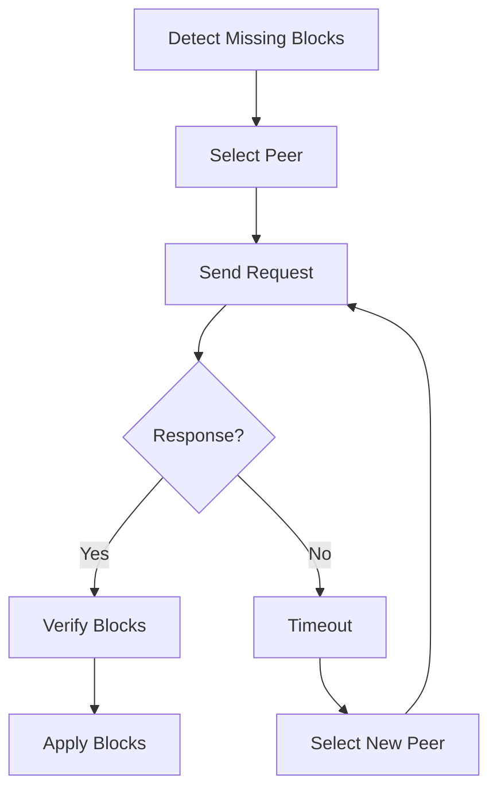

# Advanced Topics

This guide covers advanced features of the BFT consensus engine including the blacklist system, write-ahead logging, timeout handling, and performance optimization.

## Blacklist System

The blacklist system uses **orbital tracking** to detect and handle Byzantine nodes. It provides a decentralized way to identify nodes that fail to perform their duties as block proposers.

### Orbital Mechanics

The concept of "orbit" tracks how many times a node should have been selected as leader:

```go
func Orbit(round uint64, nodeIndex uint16, nodeCount uint16) uint64 {
    inCycle := round % uint64(nodeCount)
    cycles := round / uint64(nodeCount)

    if inCycle >= uint64(nodeIndex) {
        return cycles + 1
    }

    return cycles
}
```

**Key Concepts:**
- **Orbit**: Number of times a node has been leader from genesis to current round
- **Suspicion**: Nodes are suspected when they fail to propose blocks
- **Redemption**: Suspected nodes can be redeemed by successfully proposing

### Blacklist Structure

```go
type Blacklist struct {
    NodeCount      uint16              // Total validators
    SuspectedNodes SuspectedNodes      // Map of suspected nodes
    Updates        BlacklistUpdates    // Proposed updates
}

type SuspectedNodes map[uint16]uint64  // nodeIndex -> orbit
```

### Suspicion and Redemption

#### Suspecting a Node

A node is suspected when:
1. It fails to propose a block when selected as leader
2. Network agrees through empty votes
3. Suspicion is recorded at the node's current orbit

```go
// Example: Node 3 suspected at orbit 5
blacklist.SuspectedNodes[3] = 5
```

#### Redeeming a Node

A node is redeemed when:
1. It successfully proposes a block
2. It was previously suspected
3. Redemption clears the suspicion

```go
// Example: Node 3 redeemed
delete(blacklist.SuspectedNodes, 3)
```

### Blacklist Updates

Updates are proposed by block builders and validated by the network:

```go
type BlacklistUpdate struct {
    NodeIndex uint16
    Type      UpdateType  // Suspect or Redeem
}
```

**Validation Rules:**
- Maximum updates per block: `nodeCount / 3`
- Node can only be updated once per block
- Suspected nodes cannot be suspected again
- Only suspected nodes can be redeemed

### Byzantine Detection Strategy

The blacklist system enables:
1. **Automatic Detection**: Failed proposals trigger suspicion
2. **Network Agreement**: Consensus on Byzantine behavior
3. **Recovery Path**: Byzantine nodes can recover by behaving correctly
4. **No Central Authority**: Fully decentralized detection

## Write-Ahead Logging (WAL)

WAL provides durability and crash recovery for the consensus engine.

### WAL Architecture

```go
type WriteAheadLog interface {
    Append([]byte) error      // Write record
    ReadAll() ([][]byte, error) // Read all records
}
```

### Record Types

The WAL stores four types of records:

1. **Block Records**: Proposed blocks
2. **Notarization Records**: Vote aggregations
3. **Empty Notarization Records**: Timeout votes
4. **Finalization Records**: Final confirmations

### WAL Recovery Process

During startup, the engine recovers state from WAL:

```go
func (e *Epoch) recoverFromWAL() error {
    records, err := e.WAL.ReadAll()
    if err != nil {
        return err
    }

    for _, record := range records {
        // Parse record type
        switch recordType {
        case BlockRecord:
            e.recoverBlock(record)
        case NotarizationRecord:
            e.recoverNotarization(record)
        case FinalizationRecord:
            e.recoverFinalization(record)
        }
    }
    return nil
}
```

### WAL Best Practices

1. **Durability**: Use `fsync` after each write
2. **Rotation**: Implement log rotation to prevent unbounded growth
3. **Compression**: Compress old segments
4. **Checksums**: Add checksums for corruption detection
5. **Cleanup**: Remove records for finalized blocks

### WAL Performance Tuning

```go
// High-performance WAL configuration
type WALConfig struct {
    SyncPolicy     SyncPolicy  // Immediate, Batch, or Periodic
    BatchSize      int         // Records per batch
    MaxSegmentSize int64       // Bytes per segment
    Compression    bool        // Enable compression
}
```

## Timeout Handling

The timeout handler ensures liveness by triggering actions when expected events don't occur.

### Timeout Handler Architecture

```go
type TimeoutHandler struct {
    tasks map[string]map[string]*TimeoutTask
    heap  TaskHeap
    now   time.Time
}

type TimeoutTask struct {
    NodeID   NodeID
    TaskID   string
    Task     func()
    Deadline time.Time
}
```

### Timeout Types

#### 1. Proposal Timeout

Triggers when block proposal is not received:

```go
handler.RegisterTask(&TimeoutTask{
    NodeID:   leader,
    TaskID:   "proposal-round-" + round,
    Deadline: time.Now().Add(MaxProposalWait),
    Task: func() {
        // Send empty vote
        epoch.sendEmptyVote(round)
    },
})
```

#### 2. Replication Timeout

Triggers when requested blocks are not received:

```go
handler.RegisterTask(&TimeoutTask{
    NodeID:   peer,
    TaskID:   "replication-" + blockRange,
    Deadline: time.Now().Add(ReplicationTimeout),
    Start:    startBlock,
    End:      endBlock,
    Task: func() {
        // Retry from different peer
        replication.retryRequest(startBlock, endBlock)
    },
})
```

#### 3. Progress Timeout

Ensures consensus makes progress:

```go
handler.RegisterTask(&TimeoutTask{
    TaskID:   "progress-check",
    Deadline: time.Now().Add(ProgressTimeout),
    Task: func() {
        // Check if we're stuck
        if epoch.GetRound() == lastRound {
            // Escalate to next round
            epoch.escalateRound()
        }
    },
})
```

### Timeout Configuration

```go
type TimeoutConfig struct {
    ProposalTimeout    time.Duration  // Wait for block proposal
    VoteTimeout        time.Duration  // Wait for votes
    ReplicationTimeout time.Duration  // Wait for block sync
    ProgressTimeout    time.Duration  // Overall progress check
}

// Production settings
config := TimeoutConfig{
    ProposalTimeout:    10 * time.Second,
    VoteTimeout:        5 * time.Second,
    ReplicationTimeout: 30 * time.Second,
    ProgressTimeout:    60 * time.Second,
}
```

## Replication Protocol

The replication protocol enables fast synchronization of missing blocks.

### Replication State Management

```go
type ReplicationState struct {
    pendingRequests map[string]*ReplicationRequest
    lastRequest     map[NodeID]time.Time
    backoffTime     map[NodeID]time.Duration
}
```

### Replication Strategy

1. **Gap Detection**: Identify missing blocks
2. **Peer Selection**: Choose optimal peer
3. **Request Batching**: Request multiple blocks
4. **Timeout Handling**: Retry on failure
5. **Backoff**: Exponential backoff for failed peers

### Replication Flow



### Replication Optimization

```go
type ReplicationOptimization struct {
    MaxBatchSize     int           // Blocks per request
    ParallelRequests int           // Concurrent requests
    PeerScoring      bool          // Track peer reliability
    Compression      bool          // Compress responses
}
```

## Monitor and Scheduler

The monitor handles asynchronous task execution while the scheduler manages dependencies.

### Monitor Architecture

```go
type Monitor struct {
    tasks     chan Task
    workers   int
    startTime time.Time
}

func (m *Monitor) Schedule(delay time.Duration, task func()) {
    m.tasks <- Task{
        RunAt: m.startTime.Add(delay),
        Func:  task,
    }
}
```

### Scheduler Dependencies

The scheduler ensures tasks execute in dependency order:

```go
type scheduler struct {
    dependencies map[string][]string
    completed    map[string]bool
    pending      []Task
}

func (s *scheduler) AddDependency(task, dependency string) {
    s.dependencies[task] = append(s.dependencies[task], dependency)
}
```

### Task Execution Pattern

```go
// Example: Block must be verified before notarization
sched.AddDependency("notarize-100", "verify-100")
sched.AddDependency("finalize-100", "notarize-100")

sched.Execute("verify-100", verifyBlock)
sched.Execute("notarize-100", notarizeBlock)  // Waits for verify
sched.Execute("finalize-100", finalizeBlock)  // Waits for notarize
```

## Performance Optimization

### Signature Verification

Optimize BLS signature verification:

```go
// Batch verification
func BatchVerify(messages [][]byte, signatures [][]byte, signers []NodeID) error {
    // Aggregate and verify in single operation
    return bls.BatchVerify(messages, signatures, signers)
}

// Parallel verification
func ParallelVerify(sigs []Signature) error {
    errChan := make(chan error, len(sigs))
    for _, sig := range sigs {
        go func(s Signature) {
            errChan <- verify(s)
        }(sig)
    }
    // Collect results...
}
```

### Memory Management

Efficient memory usage strategies:

```go
type MemoryConfig struct {
    MaxRounds        int    // Rounds to keep in memory
    MaxFutureRounds  int    // Future rounds to accept
    MessagePoolSize  int    // Message buffer size
    SignatureCacheSize int  // Cached verifications
}

// Production settings
config := MemoryConfig{
    MaxRounds:         100,
    MaxFutureRounds:   10,
    MessagePoolSize:   10000,
    SignatureCacheSize: 5000,
}
```

### Network Optimization

```go
type NetworkOptimization struct {
    MessageBatching   bool          // Batch small messages
    Compression       bool          // Compress large messages
    Priority          bool          // Priority message queues
    RateLimiting      bool          // Rate limit per peer
}
```

## Security Considerations

### Message Validation

Strict validation of all consensus messages:

```go
func validateMessage(msg *Message, from NodeID) error {
    // 1. Check sender is valid validator
    if !isValidator(from) {
        return ErrInvalidSender
    }

    // 2. Check message is for current epoch
    if msg.Epoch != currentEpoch {
        return ErrWrongEpoch
    }

    // 3. Verify signature
    if err := verifySignature(msg); err != nil {
        return err
    }

    // 4. Check message is not from future
    if msg.Round > currentRound + MaxFutureRounds {
        return ErrFutureMessage
    }

    return nil
}
```

### DOS Protection

Protect against denial-of-service attacks:

```go
type DOSProtection struct {
    RateLimit        int           // Messages per second
    MaxMessageSize   int           // Maximum message bytes
    BanDuration      time.Duration // Ban duration for bad actors
    MaxConnections   int           // Per-peer connections
}
```

## Debugging and Monitoring

### Debug Utilities

Built-in debugging capabilities:

```go
// Enable verbose logging
epoch.SetLogLevel(Verbo)

// Dump internal state
state := epoch.DumpState()
fmt.Printf("Round: %d, Height: %d\n", state.Round, state.Height)

// Trace message flow
epoch.EnableMessageTracing(true)
```

### Metrics Collection

Key metrics to monitor:

```go
type ConsensusMetrics struct {
    Round              uint64
    Height             uint64
    NotarizationTime   time.Duration
    FinalizationTime   time.Duration
    MessageCount       map[string]int64
    SignatureVerifications int64
    WALWrites          int64
    ReplicationRequests int64
}
```

### Health Checks

Implement comprehensive health checks:

```go
func (e *Epoch) HealthCheck() HealthStatus {
    return HealthStatus{
        Bootstrapped:   e.isBootstrapped(),
        CurrentRound:   e.GetRound(),
        LastBlockTime:  e.lastBlockTime,
        PeerCount:      len(e.nodes),
        WALStatus:      e.WAL != nil,
        Replicating:    e.ReplicationEnabled,
    }
}
```

## Common Pitfalls and Solutions

### Pitfall 1: Memory Leaks

**Problem**: Unbounded growth of round cache
**Solution**: Implement proper cleanup

```go
func (e *Epoch) cleanupOldRounds() {
    threshold := e.round - MaxRounds
    for round := range e.rounds {
        if round < threshold {
            delete(e.rounds, round)
        }
    }
}
```

### Pitfall 2: Network Partitions

**Problem**: Nodes get isolated from network
**Solution**: Implement partition detection

```go
func detectPartition() bool {
    // No messages received for extended period
    return timeSinceLastMessage > PartitionTimeout
}
```

### Pitfall 3: Clock Skew

**Problem**: Nodes have different system times
**Solution**: Use logical timestamps

```go
type LogicalClock struct {
    time    uint64
    nodeID  NodeID
}

func (lc *LogicalClock) Tick() {
    lc.time++
}
```

## Advanced Configuration Examples

### High-Throughput Configuration

```go
config := EpochConfig{
    MaxProposalWait:    2 * time.Second,   // Fast timeouts
    MaxRebroadcastWait: 5 * time.Second,
    ReplicationEnabled: true,               // Fast sync
    // Enable optimizations
}
```

### High-Security Configuration

```go
config := EpochConfig{
    MaxProposalWait:    30 * time.Second,  // Conservative timeouts
    MaxRebroadcastWait: 60 * time.Second,
    WAL:                secureWAL,         // Encrypted WAL
    // Enhanced validation
}
```

### Resource-Constrained Configuration

```go
config := EpochConfig{
    // Minimal memory usage
    MaxRounds:       10,
    MessagePoolSize: 100,
    // Disable optional features
    ReplicationEnabled: false,
}
```

## Next Steps

- [Configuration Reference](/docs/configuration) - Detailed configuration options
- [API Reference](/docs/api) - Complete API documentation
- [Testing Guide](/docs/testing) - Testing strategies and tools